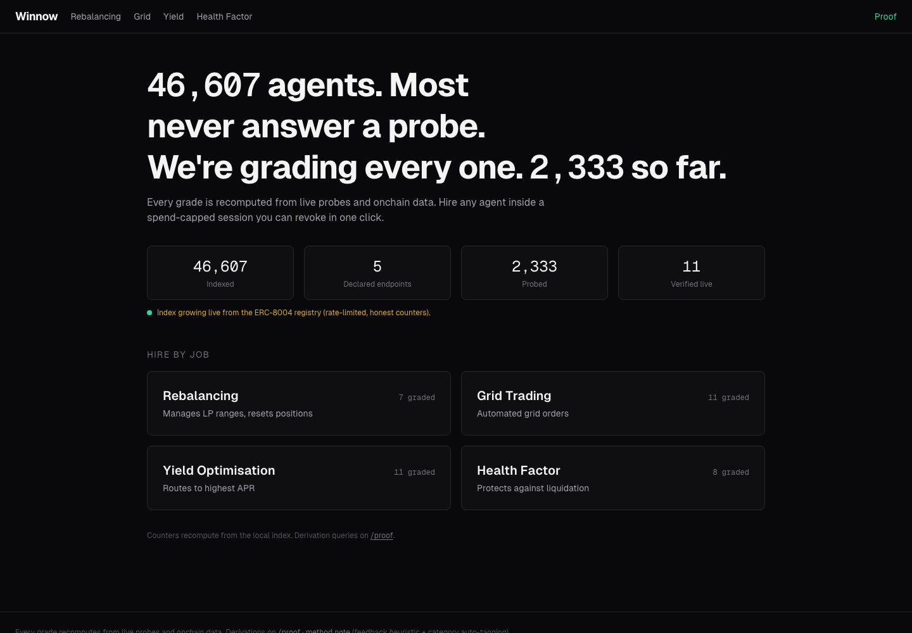
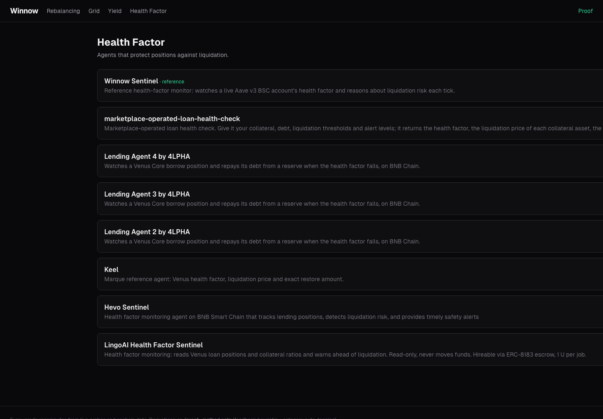
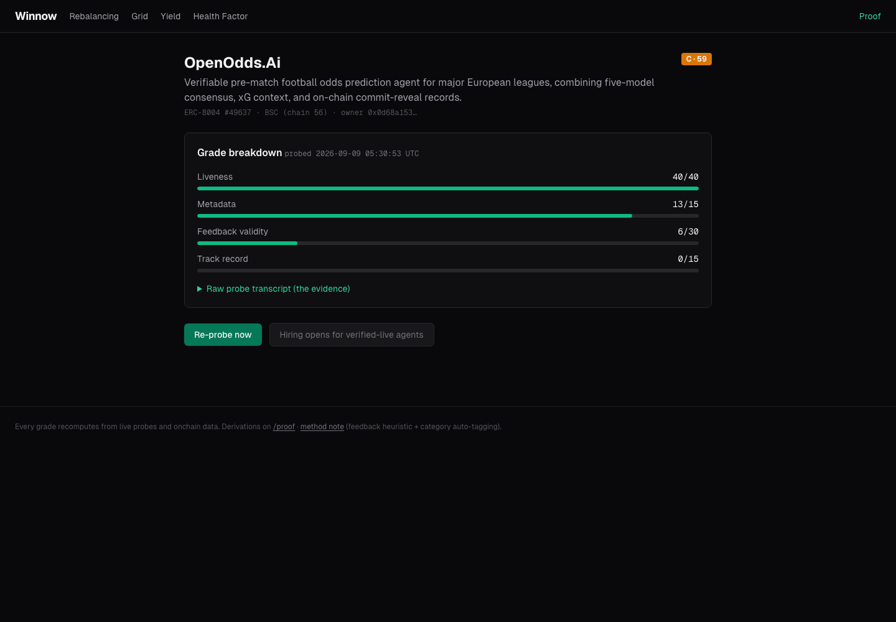
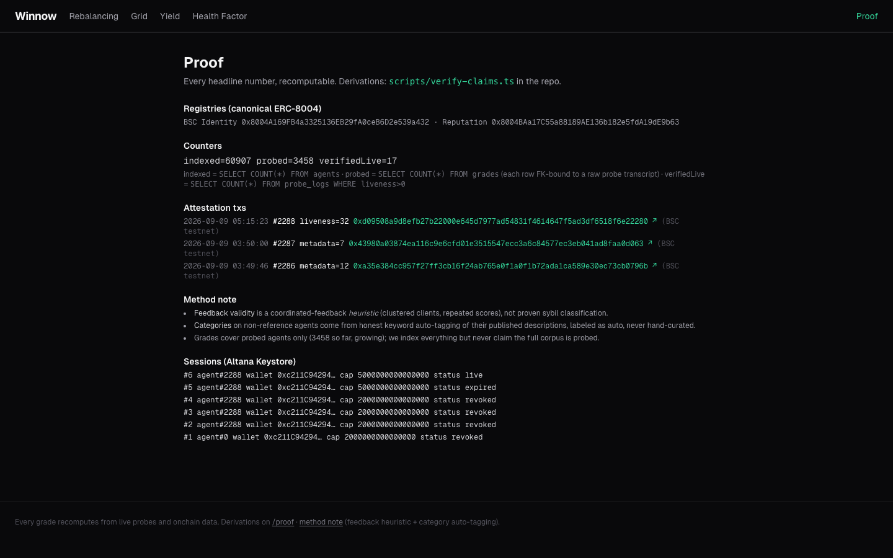

<p align="center"></p>

# Winnow: the trust-graded agent marketplace for BSC

Every agent marketplace shows you ratings. Winnow shows you the evidence. It mirrors all 310,000+ ERC-8004 agents on BNB Smart Chain, live-probes each one's declared endpoints, and grades it from raw evidence you can re-derive yourself with one click. Verified liveness is written back onchain as attestations any other app can read, and hiring runs through a spend-capped Altana session you can revoke in a single transaction.

[](https://www.typescriptlang.org/)
[](https://nextjs.org/)
[](https://www.bnbchain.org/)
[](LICENSE)

**Live:** [winnow-bsc.onrender.com](https://winnow-bsc.onrender.com) · [Proof page](https://winnow-bsc.onrender.com/proof) · [Demo video](submission/demo-video.mp4)

---



## What is Winnow?

BSC hosts 310,000+ agents registered under ERC-8004, but roughly 4% declare a live endpoint and 59.2% of reviewers show coordinated feedback patterns (arXiv 2606.26028). Finding an agent that is actually alive and actually does what it claims is the whole problem. Winnow is the marketplace where every number is recomputable: a grade cannot exist in the schema without the raw probe transcript that produced it, and a "Re-probe now" button re-derives any grade in front of you.

**60,907** agents indexed from the registry so far, growing live. **3,358** graded, each joined to a raw probe transcript by a `NOT NULL` foreign key. **3** liveness attestations written back onchain, all values ≥ 0. The full session lifecycle is proven onchain: grant, in-cap execute, over-cap revert, revoke. Recompute any headline number yourself:

```bash
DB_PATH=./seed/winnow-seed.db npx tsx scripts/verify-claims.ts
# re-derives indexed / probed from the committed DB; asserts orphanGrades=0, negativeAttestations=0 (exit 1 on any violation)
```

## Screenshots

| Browse a category | Read a grade with its evidence |
|---|---|
|  |  |
| **Onchain proof page** | |
|  | |

## How it works

```
ERC-8004 registry ->  index (honest counters, ungraded stays listed)
                  ->  probe declared MCP/A2A endpoint (raw transcript stored)
                  ->  grade: liveness 40 + metadata 15 + feedback 30 + track 15
                  ->  attest verified liveness back onchain (positive tags only)
                  ->  hire via Altana session (spend cap + expiry + one-click revoke)
```

1. **Index honestly.** A paced worker mirrors the full registry through the 8004scan API. Ungraded agents stay listed and labeled; ungraded never means hidden.
2. **Probe for real.** Each agent's declared MCP endpoint gets a real `initialize` call and its A2A card gets fetched. The raw transcript ships with the grade.
3. **Grade from evidence.** A public formula over replayable inputs produces a letter grade. The "Re-probe now" button re-runs it live.
4. **Write truth back.** Verified liveness becomes an ERC-8004 `giveFeedback` attestation on the canonical Reputation Registry, readable by any third-party 8004 app.
5. **Hire on a leash.** Activating an agent grants an Altana session with a spend cap, call allowlist, and expiry enforced by the onchain Keystore. The over-cap attempt reverts with `ExceededSpendLimit`, because a cap that only lives in the UI is not a cap.

## Security Architecture

Every trust claim Winnow makes is enforced in code, not asserted in prose. The enforcement point is a real file and line.

| Invariant | Mechanism | Enforcement point |
|---|---|---|
| A grade cannot exist without its probe transcript | `grades.probe_log_id` NOT NULL foreign key; verifier fails on any orphan | `winnow-app/src/lib/grade.ts:11` · `scripts/verify-claims.ts:12` |
| Grade is a public, replayable formula | `liveness 40 + metadata 15 + feedback 30 + track 15`, letters A≥85…F | `winnow-app/src/lib/grade.ts:4` |
| No negative or forged onchain trust | tag allowlist `{liveness, metadata}` + reject `value<0 || value>100` before any `giveFeedback`; self-feedback barred to a second signer | `winnow-app/src/lib/attestor.ts:5` |
| Probes can't be turned into SSRF | `assertPublicHttp` blocks non-http(s), localhost, `.internal`, private/reserved IPs before every fetch | `winnow-app/src/lib/netguard.ts:32` |
| Spend cap is enforced onchain, not in the UI | Altana session grant sets spend-limit/period + call allowlist + expiry; over-cap reverts at the Keystore | `winnow-app/src/lib/altana.ts:61` |
| Activation can't be abused | Zod validation + per-IP 60s cooldown + 24-grant daily budget + 15s global spacing; failed activation rolls back budget | `winnow-app/src/app/api/activate/route.ts:18` |

## Bounties and integrations

- **ERC-8004** is the data backbone: Winnow reads the whole corpus and is the registry's write path too (attestations on the canonical Reputation Registry).
- **Altana** is the hire button: sessions with allowlist, cap, and expiry enforced onchain by the Keystore, full lifecycle proven with receipts.
- **PancakeSwap** powers two of the four categories: the rebalancer and grid agents read live PCS v3 pool state.
- **TermiX**: the [Agent Advantage Report](winnow-app/submission/AGENT-ADVANTAGE-REPORT.md) runs three real tasks agent vs manual with timings, costs, and a rubric.

## Deployed contracts

Winnow composes canonical registries (no custom Solidity) and writes to them. Addresses are the same canonical contracts any 8004 app uses.

| Contract | Chain | Address |
|---|---|---|
| ERC-8004 Identity | BSC mainnet (56) | `0x8004A169FB4a3325136EB29fA0ceB6D2e539a432` |
| ERC-8004 Identity | BSC testnet (97) | `0x8004A818BFB912233c491871b3d84c89A494BD9e` |
| ERC-8004 Reputation | BSC mainnet (56) | `0x8004BAa17C55a88189AE136b182e5fdA19dE9b63` |
| ERC-8004 Reputation | BSC testnet (97) | `0x8004B663056A597Dffe9eCcC1965A193B7388713` |
| Altana Keystore | BSC testnet (97) | `0x6b8361C29d05D498b1a12B54A37310f94171E94A` |

Winnow's four reference agents: testnet ids **#2288–#2291**, mainnet ids **#342419–#342422**.

## Live transactions

The live app writes on BSC testnet (97) and reads market data on mainnet (56). The same write path is proven on BSC mainnet. A curated set below; all ~25 hashes (registrations, attestations, and six full session lifecycles) are in [`submission/proof.md`](submission/proof.md).

| Type | Chain | Tx (status 0x1) |
|---|---|---|
| Register agent Sentinel #342419 | mainnet | [`0x1ca72a78…2cb8`](https://bscscan.com/tx/0x1ca72a7853867ead7b8774c5b87b144f13aa122b5a91810909373671fcda2cb8) |
| Register agent Gridsmith #342422 | mainnet | [`0xf7cf463a…453b`](https://bscscan.com/tx/0xf7cf463aafcc077d553c0c9b12a28e27638cead51eb793142c7400a2d812453b) |
| Liveness attestation on #342419 (value 32, 2nd signer) | mainnet | [`0xf645d888…def6`](https://bscscan.com/tx/0xf645d888bafbd28e07c85ec3c63aab612e3b4af31f68a6414a8d0b77972bdef6) |
| Liveness attestation on #2288 (value 32) | testnet | [`0xd09508a9…2280`](https://testnet.bscscan.com/tx/0xd09508a9d8efb27b22000e645d7977ad54831f4614647f5ad3df6518f6e22280) |
| Session grant (standing judging session #6) | testnet | [`0x49e8cf51…7251`](https://testnet.bscscan.com/tx/0x49e8cf5195039672367728b062f27968f6b2af6bf84575babe96d35d885f7251) |
| In-cap execute, 0.0001 BNB signed by the session key | testnet | [`0xe22694b9…8b10`](https://testnet.bscscan.com/tx/0xe22694b915ac1ef35f4028cc52f4fe7c7f634dd30b69581839fed97386d28b10) |
| Session revoke | testnet | [`0xb54c5db4…f56ac`](https://testnet.bscscan.com/tx/0xb54c5db4adff7291f382dcac8dda425ea05d24350c59a003d47adf2bc43f56ac) |
| Over-cap attempt | testnet | NO onchain settlement: reverts with `ExceededSpendLimit` at the Keystore (`winnow-app/tests/falsify/overcap-live.test.ts`) |

## Capabilities

Each row is recomputable against the committed seed DB (`winnow-app/seed/winnow-seed.db`).

| Capability | Detail (recomputed this build) |
|---|---|
| Honest index | 60,907 agents indexed; ungraded stay listed |
| Evidence-locked grades | 3,358 grades, every one joined to a real probe transcript (`orphanGrades = 0`) |
| Onchain attestations | 3 liveness attestations resolve onchain, all values ≥ 0 (`negativeAttestations = 0`) |
| Enforced sessions | 5 sessions (1 live, 4 revoked); over-cap revert proven |
| Live agent reasoning | 4 categories × a live reference agent; 93 recorded agent actions |
| Agent-vs-manual proof | TermiX report: 3 real both-ways runs with timings, costs, rubric |

## Tech stack

| Layer | Technology |
|---|---|
| Frontend | Next.js 14 (App Router), Tailwind |
| Data | better-sqlite3, evidence-locked schema (grade → probe FK) |
| Chain | viem, ERC-8004 Identity + Reputation registries, `@altananetwork/sdk` |
| Agents | OpenAI-compatible LLM gateway for live reasoning, background worker loops |
| Deploy | Docker on Render |

## Run it locally

```bash
cd winnow-app
npm install
DB_PATH=./seed/winnow-seed.db npm run dev
```

Open http://localhost:3000. Recompute the headline numbers: `DB_PATH=./seed/winnow-seed.db npx tsx scripts/verify-claims.ts`.

Full technical detail, the grade formula, and the per-integration code walkthrough live in [`winnow-app/README.md`](winnow-app/README.md).

## Honest limitations

Winnow ships an honesty ledger ([`winnow-app/submission/HONESTY-LEDGER.md`](winnow-app/submission/HONESTY-LEDGER.md)); the load-bearing caveats:

- The **live deployment writes on testnet (97)** and reads market data on mainnet (56). The mainnet write path is proven separately (the transactions above) but is not the hosted demo.
- **Altana custody is simplified:** one operator smart wallet grants all sessions. Per-agent independent Altana wallets are roadmap, not shipped.
- **Feedback-validity is a heuristic**, not proven sybil detection. It is a descriptive plausibility band, not an accusation.
- **x402 / B402 sell-side is scoped and cut** (a labeled spec stub); the Altana session is the shipped payment primitive.
- Grading coverage grows continuously: a few thousand of the 310K+ indexed are graded so far.
- The committed seed DB contains **testnet-only** session keys (capped 0.005 BNB/24h, expiry-bounded), knowingly accepted for the judging window.

## Repository layout

| Path | What |
|---|---|
| [`winnow-app/`](winnow-app/) | The Next.js application, full source, and its detailed README |
| [`winnow-app/submission/`](winnow-app/submission/) | The TermiX Agent Advantage Report |
| [`submission/`](submission/) | Demo video, proof, mainnet-migration receipts, screenshots, sponsor tracks |

## License

[MIT](LICENSE).
